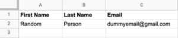
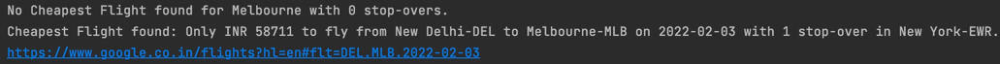
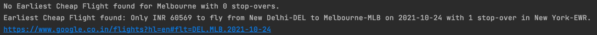
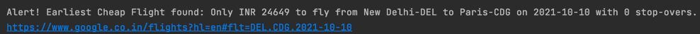

Use this Flight Deal Finder App to find the cheapest flight to your list of destinations, within the next 6 months.

Update the variables.py with your api keys and details.     
Update the destinations you want to visit and the highest price you are willing pay for their flights, in your Google Sheet.  
Also update the sheet with users in your club who want to be notified via email. Link your Google Sheet to Sheety API.   
Sample Google Sheet:        
         
         

This code then uses Sheety and Flight Search API to populate your Google Sheet with International Air Transport Association (IATA) codes for each city.      
It checks for the flights with price lower than the highest price listed in the Google Sheet, from today to 6 months later, for all the cities in the sheet.  
If a flight is found, it sends an email to all the emails in the sheet using SMTPLib and an SMS to your number using Twilio API.
The message includes the flight price, flight date, departure city, departure airport code, arrival city and arrival airport code. It also includes a Google Flights link for that flight.           

Sample SMS:     
           
        
Output:         
         
         
         
        
API's used:     
Google Sheet Data Management - https://sheety.co/   
Tequila Flight Search API Documentation - https://tequila.kiwi.com/portal/docs/tequila_api      
Twilio SMS API - https://www.twilio.com/docs/sms        

